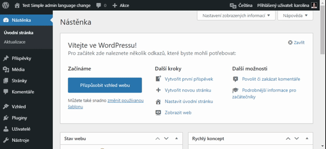

# Simple Admin Language Change

[](https://wordpress.org/plugins/simple-admin-language-change)

The lightweight plugin extends the default functionality and pulls out the language selection to the admin bar so you can easily switch between them.



## Customization

Use the `salc_languages` filter to control which languages appear in the dropdown:

```php
add_filter( 'salc_languages', function ( $languages ) {
    $allowed = array( 'en_US', 'cs_CZ', 'de_DE' );
    $languages['available'] = array_filter(
        $languages['available'],
        function ( $lang ) use ( $allowed ) {
            return in_array( $lang['value'], $allowed, true );
        }
    );
    return $languages;
} );
```
